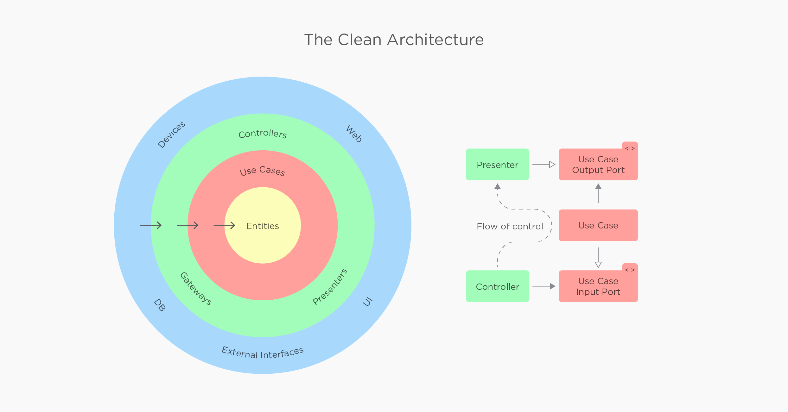

# DroidFoodApplication
In this project we will call a api and get the data and display it, along with it we are caching it locally so that when your application is in offline, still we are able to display the data

---

| **Clean Architecture** | **Project is developed using the libraries** |
| --- | --- |
| [Clean architecture layered diagram](https://github.com/devrath/DroidFoodApplication/blob/main/README.md#clean-architecture-layered-diagram) | [Retrofit](https://github.com/devrath/DroidFoodApplication/blob/main/README.md#retrofit)|
| [What is it](https://github.com/devrath/DroidFoodApplication/blob/main/README.md#what-is-clean-architecture) | [Coil](https://github.com/devrath/DroidFoodApplication/blob/main/README.md#coil)|
| [Advantages](https://github.com/devrath/DroidFoodApplication/blob/main/README.md#advantages-of-clean-architecture) | [Hilt](https://github.com/devrath/DroidFoodApplication/blob/main/README.md#hilt) |
| [Components](https://github.com/devrath/DroidFoodApplication/blob/main/README.md#advantages-of-clean-architecture) | [Kotlin-Dsl](https://github.com/devrath/DroidFoodApplication/blob/main/README.md#kotlin-dsl) |
|  | [Room](https://github.com/devrath/DroidFoodApplication/blob/main/README.md#room) |
|  | [DataStore Preferences](https://github.com/devrath/DroidFoodApplication/blob/main/README.md#datastore-preferences) |

---

### ``Clean architecture layered diagram``

* From the diagram, we can see that lower-level `Entities` basically define `Enterprice business rules`.
* Next to it is use cases, We can see that arrows from `use case layer` that encopass `Application business rules` point to `Entities`. The `Entities` cannot use anything from `use case layer`.
* `Entities` apply to the whole business in general. `Use cases` are how you use those `entities(Business rules)`. Then the green color layer contains things like `controllers`,`presenters`,`etc`, This layer prepares the data and pass it into upper layer which is `presenter`. The presenter is the blue layer which is dealing with how the data is presented to the user.

---

### ``What is clean architecture``

* It is a way to organize the the project to achieve `maintainability` and `scalability`.
* Mantra is to have one concern per component - > Meaning each piece of our architecture does only one thing and nothhing else.
* If one componet has 2 concerns or more, Then we need to split them up so that we have one concern each.
* It is structured in layers of dependency. One layer depend on another layer and kind of have a relationship.
* Implementation layers depends on abstract layers meaning how we implement something depend depend on what we implement
* It is not specific to mobile development, It not a mobile architecture, It's a software development architecture 

### ``Advantages of clean architecture``

* `Strict architecture`, So it's not easy to make mistakes.
* `Business logic is encapsulated`, So it's to use and test.
* `Enforcement` of depencencies through encapsulation.
* `Parallel` development.
* `Highly scalable`, we can grow a small project with clean architecture to a large project without bumping into problems.
* `Easy` to understand and maintain. 
* `Testing` is facilitated.

---

### ``Components of clean architecture``

---

### ``Retrofit``

* Developer friendly library
* Easy to Configure
* Less boiler plate code
* Supports internal parsing using GSON,Jakson,Moshi, can be configured
* Supports caching
* Annotation based setting requests
* Supports error handeling
* Easy to define retry and timeouts using the interceptor
* Endpoint can be added in one place
* Support to FLOW api of coroutines
* Support to suspend function of coroutines
* Very well documented and tested

---
### ``Coil``

* Coil is a image loading library.
* Coil is built to work efficiently with kotlin.
* Coil loads images very faster with the number of optimizations which includes memory, disk caching, reusing of bitmaps, and down spacing the image in memory which makes it faster in comparison with other image loading libraries.
* Library very lightweight and easy to use because it adds around two thousand methods, to your APK which are very less in number in comparison with Picasso, Glide, and universal image loader.
* Library uses modern libraries of Android such as Okio, OkHttp, and AndroidX lifecycles.
* Library aoids annotation processing which can often slow down build speeds. Coil depends on Kotlin's extension functions instead.

---
### ``Kotlin-Dsl``

* Gradle is written in groovy programming language, But we write the rest of project in kotlin. using kotlin-dsl.
* Using the kotlin-dsl, we can organize the dependencies in our project more clean and in a efficient way.
* Type safety. Which allows better autocompletion which was missing from grovey till now.
* Code navigation between files becomes easy in Kotlin DSL.
* We can use all the functionalities of kotlin in our gradle file.
* Refactoring is much easier.

---
### ``DataStore Preferences``

* It is one of the data storage solution from android jetpack. 
* It allows to store the data in the form of key and value pairs similar to shared preferences.
* It is a replacement to shared preferences. 
* Shared preferences are synchronous and are not main thread safe but the sata store is safe to use in main thread since it uses dispatchers.io under the hood.
* It is easy to migrate from shared preferences 
* Unlike the shared preferences which is not safe from runtime exceptions, the data store is safe from runtime exceptions.

---
### ``Room``

* Compile-time verification of queries.
* Reduces boilerplate code.
* Easy to understand and use.
* Easy integration with RxJava, LiveData and Kotlin Coroutines.
* It is a part of android jetpack library.

---
### ``Hilt``

* Reusability of code.
* Ease of refactoring.
* Ease of testing.
* One of the important difference that makes hilt to dagger is its easier to use than dageer even though it uses all the features of dagger under the hood.
* Component part is not there to set-up compared to dagger which makes hilt uasier to understand.
